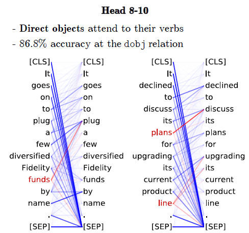

# What does BERT learn about the structure of language

## 摘要

- BERT’s phrasal representation captures
  **phrase-level information** in the **lower layers**.
- BERT’s **intermediate layers** encode a rich hierarchy of **linguistic information**
  - surface features at the bottom
  - syntactic features in the middle 
  - semantic features at the top
- BERT  require deeper layers when long-distance dependency information is required
  - track subject-verb agreement
- BERT representations capture linguistic information in a compositional way that mimics classical, tree-like structures
  - 以模仿经典的**树状结构**的合成方式捕获语言信息

## 介绍

- (Goldberg. 2019)BERT captures **syntactic phenomena** well when evaluated on its ability to **track subject-verb agreement**.
  - arXiv:1901.05287. Version 1.
- 实验
  - 低层捕捉短语级信息，这些信息在高层中会被稀释
  - 使用探针任务表明BERT捕获了多层的语言信息(Conneau et al. (2018), What you can cram into a single n$&!#* vector: Probing sentence embeddings for linguistic properties.)
  - 通过测试BERT表示在追踪主语和动词的一致性任务的能力，发现BERT需要更多层来执行包含长距离依赖的困难任务
  - 使用TPDN探索关于BERT表示的不同假设并发现BERT captures classical, tree-like structures
    - Tensor Product Decomposition Network ((McCoy et al., 2019)RNNs Implicitly Implement Tensor Product Representations. ICLR)

## 短语语法

- 给定token sequence $s_i,...,s_j$，计算每层 $l$ 的span 表示$s_{(s_i,s_j), l}$ 
  - 将隐层向量($h_{s_i,l}$)、($h_{s_j, l}$)、它们的element-wise product、它们的差 **concatenate**
- 在CoNLL 2000 chunking dataset随机选取了3000标注后的chunks和500个未标注的spans
- 可视化方法
  - span 表示
  - t-SNE
    - 可视化高维数据的一种非线性dimensionality reduction方法
  - NMI矩阵
- 结论
  - 底层捕获了phrase-level信息，这些信息在高层被稀释

##探针任务

- 使用模型的输出作为辅助任务的输入，如果辅助分类任务可以很好的预测语言属性(linguistic property)，说明原始模型可以很好的编码该属性。
- 分类
  - surface tasks
    - sentence length（`SentLen`）
    - presence of words in the sentence (`WC`)
  - Syntactic tasks
    - sensitivity to word order (`BShift`)
    - the depth of the syntactic tree (`TreeDepth`)
    - the sequence of top-level constituents in syntax tree (`TopConst`)
  - Semantic tasks
    - tense (`Tense`)
    - subject number in main clause (`SubjNum`)
    - the sensitivity to random replacement of a noun/verb (`SOMO`)
    - the random swapping of coordinated clausal conjuncts (`CoordInv`) 并列子句的随机交换
- use the `SentEval toolkit` 寻找最好的探针分类器
- random encoder 可以编码大量的词汇和结构信息（1809.10040）
- 对照组
  - 未训练的Bert（参数设置为随机值）
- 结论：surface information at the bottom, syntactic information in the middle, semantic information at the top
- 反直觉
  - 在`SentLen`任务中未训练过Bert的高层比训练后版本表现好
  - 说明：untrained models contain sufficient information to predict a basic surface feature，训练后版本预测basic surface feature的能力会弱化

## 主语动词一致性检验(Subject-Verb Agreement)

- 目标：检验神经网络是否能编码语法结构信息
- extend Goldberg(2019)的工作
  - performing the test on each layer of
    BERT
  - controlling for the number of attractors
- 结论
  - the middle layers perform well in most cases
  - syntactic features were captured well in the middle layers
  - higher BERT layers is able to handle the long-distance dependency

## 组成结构(compositional Structure)

- Tensor Product Decomposition Networks (TPDN)
  - input token representations 
    - 用tensor product sum预先选定的role scheme
- 作者猜想
  - 对于给定的role scheme ,如果TPDN训练结果近似于神经网络学习的表示，则该role scheme 可能能表示模型学到的组成结构
- 实验
  - For each BERT layer, we work with five different role schemes. Each word’s role is computed based on 
    - its left-to-right index,
    - its right-to-left index, 
    - an ordered pair containing its left-to-right and right-to-left indices, 
    - its position in a syntactic tree with no unary nodes（一元节点） and no labels
    - an index common to all the words in the sentence (bag-of-words)忽略位置信息
  - define a role scheme based on random binary trees.
  - 数据集、任务
    - SNLI corpus、premise sentence
  - 过程
    - 用来自Bert的word embedding初始化TPDN的token embedding
    - 冻结
    - 学习他们之间的线性映射
    - 使用MSE loss function
  - 结果
    - 底层layers的role scheme是R2L/L2R
    - 中高层的是tree
- case study on dependency trees induced from self attention weight
  - fixing the gold root as the starting node
  - 使用Chu-Liu-Edmonds algorithm
    - maximum spanning tree algorithm
  - 从2层11个注意力头处获得示例句子中每个词对的自注意力权重，由此推断句中依存关系
  - 结果
    - 可以精确捕捉到
      - determiner-noun限定词-名词
      - subject-verb 主语-动词
    - 部分捕捉到了推断-论据结构

## 相关工作

- Peters et al. (2018)
  - 问题：预训练模型选择对下游任务精确度的影响；学到的上下文词表示的特性
  - 结论：学的都比标准词嵌入(`GloVe`)好，这些结构分层学习了语言学特征
- Goldberg(2019)
  - BERT model captures syntactic information well for subject-verb agreement.
  - Extend 结论
    - BERT requires deeper layers for handling harder cases involving long-distance dependency information.
- Tenney et al. (2019)
  - a novel edge probing task
    - 上下文词表示法如何在一系列句法，语义，局部和长程现象中编码句子结构。
  - 结论
    - 经过语言建模和机器翻译训练的上下文单词表示法可以很好地编码句法现象，但在语义任务上相较于非上下文基准给出的改进有限
- Liu et al. (2019)
  - 上下文词嵌入没有学到细粒度的语言学知识
  - 高层的RNN会面向任务，而Transformer没这个现象
  - 在相似任务上进行预训练的性能比语言建模预训练要好
- Hewitt and Manning (2019)
  - 可以从上下文词表示的线性转换中恢复语法树，比非上下文基准效果好
  - BERT的组合模型模仿了传统的句法分析。

# What Does BERT Look At?
- An Analysis of BERT’s Attention
- **2019 ACL**  Computer Science Department, Stanford University Facebook AI Research  
- Kevin Clark Urvashi Khandelwal Omer Levy Christopher D. Manning                  

## 摘要

- rather than explaining model predictions, we are seeking to understand information learned by the models
- 提供了分析预训练模型注意力机制的方法
- 应用在BERT上
- 发现
  - BERT的注意力头
    - attending to delimiter tokens（分隔符）
    - specific positional offsets
    - broadly attending over the whole sentence
    - 相同layer的头通常表现出相似的行为
  - **certain attention heads** correspond well to linguistic notions of <u>syntax and coreference</u>
  - 提出 attention-based probing classifier

## 介绍

- recent work
  - output of language model on chosen input
  - 通过探针方法检测模型内部向量表示
- this paper
  - attention map
  - focus on 
    - 144 attention heads in BERT
    - a large pre-trained Transformer

- 研究步骤
  - generally how BERT’s attention heads behave
    - common pattern
      - attend to fixed positional offset
      - attend broadly over the whole sentence
      - 大量BERT的注意力集中于分隔符[SEP]
      - attention heads in the same layer tend to behave similarly
  - probe each attention head for linguistic phenomena
    - 将每个head看做分类器
      - input: a word 
      - output: the most-attended-to other word
    - 评估每个头分类语法关系的能力
      - 特定的head对特定的关系的分类效果好
  - 提出基于注意力的探针分类器
    - takes attention maps as input
    - 测量注意力头的syntactic ability

## Attention的Surface-Level Pattern

- 实验方法
  - 用BERT抽取1000个随机Wikipedia segments的attention maps
    - 每个片段最多包含128个令牌，分别对应于Wikipedia的两个连续段落
    - do not mask inputs
    - inputs: `[CLS]<paragraph-1>[SEP]<paragraph-2>[SEP]`
- 相关位置
  - little current、heavily next/previous
    - especially in earlier layers of the network

- Separator Tokens ( 分隔符) 
  - model treat differently token
    - [SEP]
    - [CLS]
    - periods、commas
  - 解释
    - **DOUBTFUL!** [SEP]被用来汇集segment-level 信息以便其他头读取。
      - 如果以上假设成立，我们期望attention heads 处理[SEP]广泛的连接整个segment来构建他们的表示
        - [SEP]大部分连接自身和其他[SEP] token
      - 定性分析
        - 
        - 
        - 有特定功能的head在这些功能没有被使用是倾向于连接[SEP]
    - **RIGHT!**  attention over these special tokens might be used as **a sort of “no-op”** when the attention head’s function is not applicable.
      - 验证: 特征重要性梯度图
      - 
      - how much changing the attention to a token will change BERT’s outputs
      - layer 5 后， [SEP] does not substantially change BERT’s outputs

- 集中地注意力还是广泛的注意力
  - 注意力头关注小部分词还是很多词
  - average entropy of each head’s attention distribution
    - (?)计算注意力熵的时候p(x)、q(x)是什么
    - 
    - some attention heads, especially in lower layers, have very broad attention
  - entropies for all attention heads from only the [CLS] token
    - the last layer has a high entropy from [CLS]
      - indicating very broad attention
      - 所以对NSP过程有效啦

- 探测独立的注意力头
  - probe what aspects of language they have learned
  - 实验前提
    - labeled datasets
      - 比如dependency parsing
    - word-level tasks
      - convert token-token attention maps to word-word attention maps
        - 分开加和，合并取均值
      - 为了保证the attention from each word sums to 1
    - prediction
      - given attention head and word，take word receives the most attention weight
  - Dependency Syntax
    - both “directions” of prediction for each attention head：
      - 主词与从属词的依存关系
      - 从属词与主词的依存关系
    - show predictions from a simple fixed-offset
      baseline
  - coreference resolution
    - using attention heads for semantic tasks
    - dataset: CoNLL-2012 dataset
    - 先行词选择
    - result
      - one of BERT’s attention heads achieves decent coreference resolution performance（比string 匹配高10个点，和基于规则的系统差不多）

- 探测attention head的结合
  - measure this overall “knowledge” about syntax ability 
  - 提出attention-based probing classifiers
    - 固定BERT注意力输出
      - 比如：BERT训练过程中不反向传播或只训练一小部分参数
    - basically graph-based dependency parsers
      - produces a probability distribution over other words in the sentence (how likely each other word is to be the **syntactic head** of the current one)
    - Attention-Only Probe
      - 
      - head `k`  from word `i` to word `j` 
      - both directions of attention
    - Attention-and-Word Probe
      - model
        - sets the weights of the attention heads based on the  GloVe embeddings for the input words
        - assigns the probability of word i being word j’s head as
        - 
    - 比较基准baseline
      - right branching
        - 预测head是否在dependent的右边
      - 单隐层
        - input：the GloVe embeddings for the dependent and candidate head + distance features between the two words
      - attention-and-words probe
        - 来自BERT的sttention maps
          - randomly initialized other weights
      - results from the structural probe
        - builds a probing classifier on top of BERT’s vector representations
        - 比较结果表明BERT的vector 表示蕴含中的语法信息没有attention map中多

- clustering attention heads
  - 问题
    - 同层的注意力头功能是否相似
    - 注意力头能否根据行为明确分组
  - computing the distances between all pairs of attention heads
    - 计算heads之间的JS距离
      - 
  - 结果
    - 
    - 同层类似注意力分布 
    - Bert头冗余的原因：使用了 attention dropout
      - which causes some attention weights to be zeroed-out during training

- Related Work
  - the outputs of language models 
    - 选择的 input sentences
  - internal vector representations of the model
    - input: 预训练模型的vector representations
    - trained to do a 有监督任务
    - metric 
      - If a probing classifier achieves **high accuracy**, it suggests that the input representations reflect the corresponding aspect of language (e.g., low-level syntax).