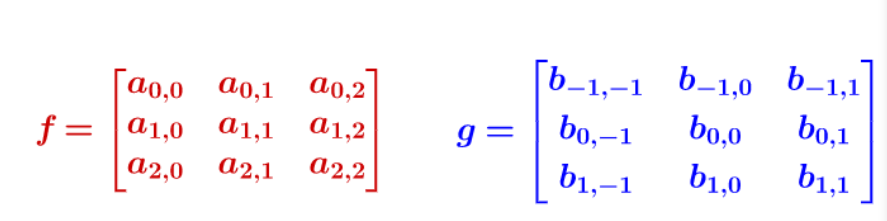

# Convolution

- 通过两个函数f,g生成第三个函数的数学算子
  - 表征函数f和
  - 经过翻转，平移的g
  - 的乘积函数围成的曲边梯形的面积
- 理解动态弹簧长度变换

## 序列角度

- 卷积是两个变量在某范围内相乘后求和的结果
- 
- 

## 函数角度公式

- 
- 以上积分定义了一个新函数$h(x)=(f*g)(x)$
- 
- 令 $\tau =x$ $n-\tau = y$ ，那么 ![[公式]](https://www.zhihu.com/equation?tex=x%2By%3Dn) 就是下面这些直线：
- 

## 图片卷积计算过程

- 
- f目标计算矩阵，g算子。注意下标加和为1
- 
- 
- 

## 卷积性质

- 

## 和傅里叶变换的关系（爷今天不想看了Y）

- https://zhuanlan.zhihu.com/p/60638534
- 两函数的傅里叶变换的乘积等于它们卷积后的傅里叶变换
- 时域中的卷积对应于频域中的乘积
- 对于一个信号，时域越长，频域越短（集中）；时域越短，频域越长。
  - 
- [中心极限定理证明](https://www.cnblogs.com/TaigaCon/p/5014957.html)

