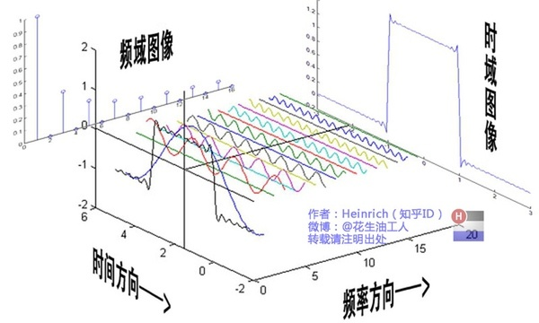
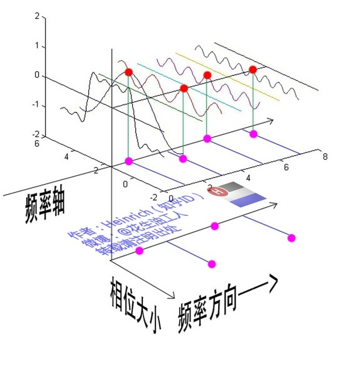
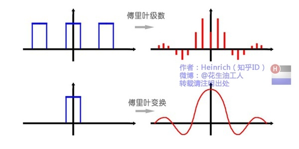
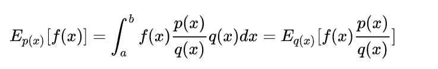
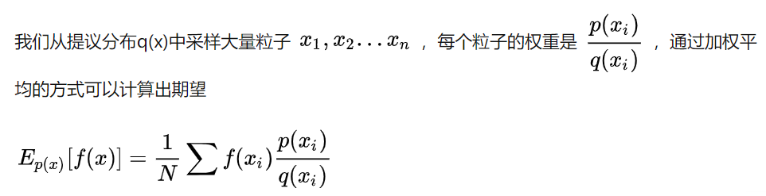

# 概率论

## 基本概念

- 概率密度函数（PDF）
  - 随机变量在某个取值点取值的概率
- 累计分布函数（CDF）
  - 随机变量在 ![[公式]](数学.assets/equation.svg) 范围内取值的概率
  - PDF的积分

## probability 和 odds

- 概率描述的是某**事件A出现的次数**与**所有结果出现的次数**之比
  - ![[公式]](https://www.zhihu.com/equation?tex=P%28A%29%3D%5Cfrac%7BNumber+%5C%3B+of%5C%3B+Event+A%7D%7BTotal+%5C%3B+Number+%5C%3B+of+%5C%3B+Events%7D)
- Odds指的是 **事件发生的概率** 与 **事件不发生的概率** 之比
  - ![[公式]](https://www.zhihu.com/equation?tex=Odds%3D%5Cfrac%7BProbability+%5C%3B+of+%5C%3B+event%7D%7BProbability+%5C%3B+of+%5C%3B+no+%5C%3B+event%7D+%3D+%5Cfrac%7BP%7D%7B1-P%7D)
  - 将概率p从[0,1]映射到[0,+∞)
- **Logit**
  - Odds的对数
  - 将概率p从[0,1]映射到(-∞,+∞)

- 
- 

## 最大似然估计

- Maximum Likelihood Estimation，简称MLE
- 常用的模型参数估计方法
- 参考阅读
  - [什么是最大似然估计](https://mp.weixin.qq.com/s?__biz=MzU5ODA0OTU1NQ==&mid=2247484201&idx=1&sn=91a3c5862dcac3940f2282ee7145284f&chksm=fe4b5555c93cdc4364ed3e8b6b963dc275f8bd92e7c06bae8687e064ee086cffaab35dfb39d9&token=360752209&lang=zh_CN&scene=21#wechat_redirect)
  - [如何利用最大似然估计来确定二项Logit模型的参数](https://mp.weixin.qq.com/s?__biz=MzU5ODA0OTU1NQ==&mid=2247484211&idx=1&sn=795f56aa11405f1f30602a978d2ccd8c&chksm=fe4b554fc93cdc596bfad31d28bc1aefd5ff9e68bf492287c54e7c16fbc936585f43278db289&token=457707948&lang=zh_CN#rd)
- 干什么用
  - 已经知道某个随机变量服从某个分布 ，参数未知，通过观测值（样本）获得参数的值
- 直观
  - 对一组小球的重量进行观测。第一个小球的重量为x，它可能是哪个分布
    - 
    - 不同分布下，观测到X=x 的概率不同
    - 最大似然估计的思想：进行一次随机的观测，观测到球的质量为x ；找到随机变量X的分布一，使得X=x这一**事件发生的概率最大**。
  - 对于参数为$\mu$、$\sigma$ 的正态分布$N(\mu,\sigma^2)$ ，$P(X=x)$ 的概率为：$P(x;\mu,\sigma)=\frac{1}{\sigma \sqrt{2\pi}}exp(-\frac{(x-\mu)^2}{2\sigma^2})$  不同参数的值对应的概率值不一样。最大似然估计的目标就是，找到一组参数值的值，使得$P(x;\mu,\sigma)$最大。 
- 举例


## 概率公式

### 全概率公式

- 
- B是一个事件，则有
  - $P(B)=\sum_{i=1}^{n} P\left(A_{i}\right) P\left(B \mid A_{i}\right)$
- 原因推结果

### 逆概率公式

- 贝叶斯公式
  - $P(A \mid B)=\frac{P(A) P(B \mid A)}{P(B)} $
  - $P(B \mid A)=\frac{P(B) P(A \mid B)}{P(A)}$
- 结果推原因

## 傅里叶变换

- [卷积、例子](https://www.cv.nrao.edu/course/astr534/FourierTransforms.html)
- 
  - 频谱只代表每一个对应的正弦波的振幅是多少，而没有提到相位，不同相位决定了波的位置
- 
  - 时间差并不是相位差。如果将全部周期看作2Pi或者360度的话，相位差则是时间差在一个周期中所占的比例。我们将时间差除周期再乘2Pi，就得到了相位差
- 

### 作用

- 傅里叶变换则可以让微分和积分在频域中变为乘法和除法


## 傅里叶级数

- 傅里叶级数的本质是将一个周期的信号分解成无限多分开的（离散的）正弦波

- 

  

# 统计

## 采样

### mente carlo sampling

- 

#### 直接采样

- 在已知CDF，不知道目标概率密度函数PDF的情况下，抽取所需数量的样本，计算CDF的反函数，使得这些样本符合目标概率密度函数

#### 取舍算法 Acceptance Rejection method

- 构造Proposed Distribution Function, 生成随机数，再在样本中按照取舍算法挑选

- ```python
  N=1000 #number of samples needed
  i = 1
  X = np.array([])
  while i < N:
      u = np.random.rand()
      x = (np.random.rand()-0.5)*8
      res = u < eval(x)/ref(x)
      if res:
          X = np.hstack((X,x[res])) #accept
          ++i
  ```

- `eval(x) ` 目标PDF，`ref(x)` 建议分布函数k

- 解释

  - 
  - 假设目标分布p(z)，给定z计算$\widetilde p(z)$ ，满足$p(z) = \frac{1}{Z_p}\widetilde p(z)$ ，$Z_p$是待定常数  
  - 选取建议分布函数q(z)，和相关常数k，满足对于所有的z，kq(z) > p(z)。
  - 在分布q(z)上生成$z_0$ ，在二维$$[0, kq(z_0)]$$ 上均匀选取$u_0$，从而$(z_0,u_0)$ 在分布kq(z)曲线下均匀分布
    - 当$u_0$ > $\widetilde p(z_0)$ 时舍弃该样本，舍弃后的二元变量在$\widetilde p(z)$ 下均匀分布
    - 样本中的$z_0$服从$p(z)$分布

- 过程

  - 首先按照建议分布函数抽样，
  - 然后取一个(0,1)之间的随机数，判断该随机数是否小于eval(x)/ref(x)，即落在目标分布函数范围内，
  - 如果满足条件，该样本被保留，否则进行下一轮测试。

#### 重要性采样

- 给予每个粒子不同的权重，使用**加权平均**的方法来计算**期望**

- 

- 

- ```python
  N=100000
  M=5000
  x = (np.random.rand(N)-0.5)*16
  w_x = eval(x)/ref(x)
  w_x = w_x/sum(w_x)
  w_xc = np.cumsum(w_x) #accumulate
  
  X=np.array([])
  for i in range(M):
      u = np.random.rand()
      X = np.hstack((X,x[w_xc>u][0]))
  ```
  - w_xc是对归一化后的权重计算的累计分布概率

